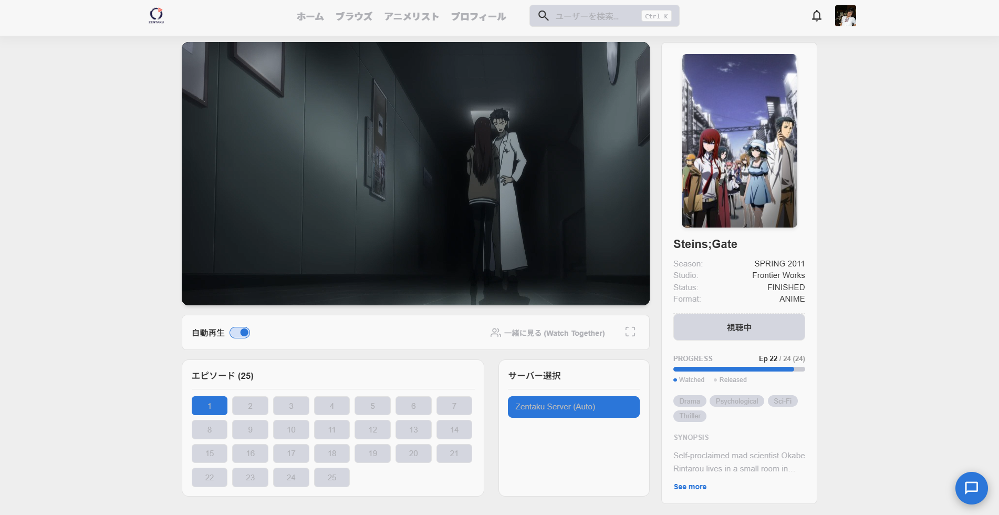
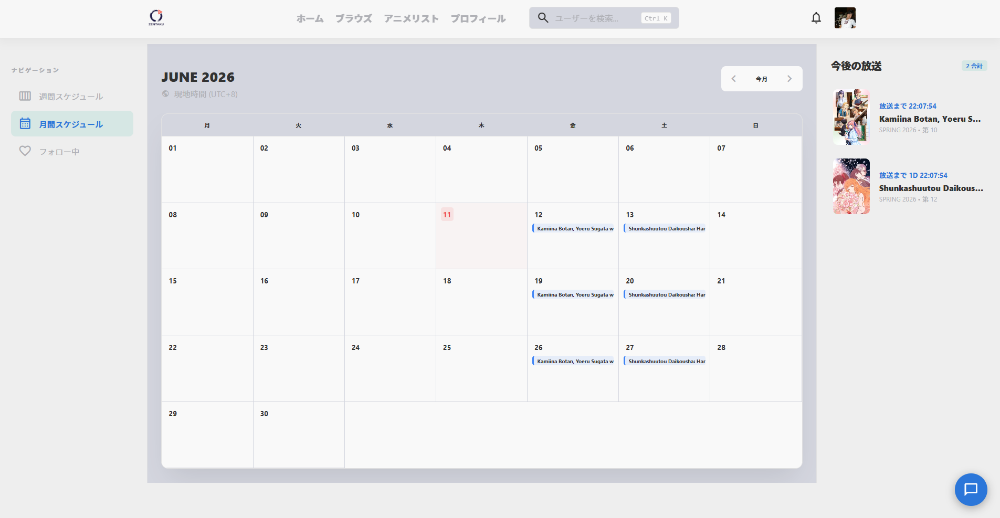
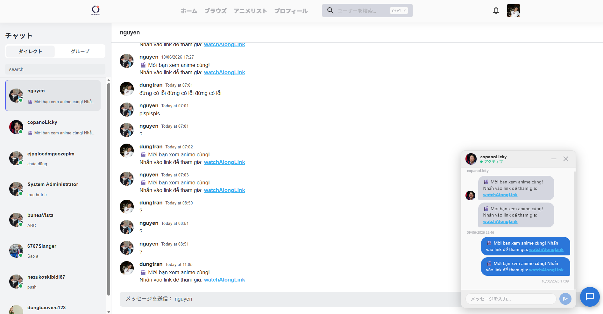
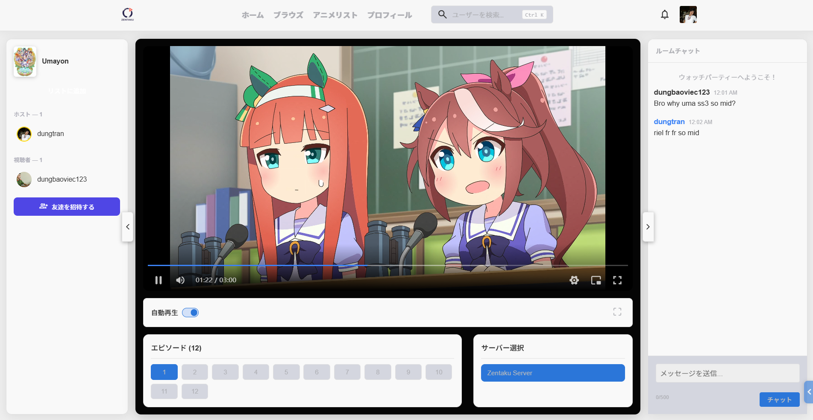
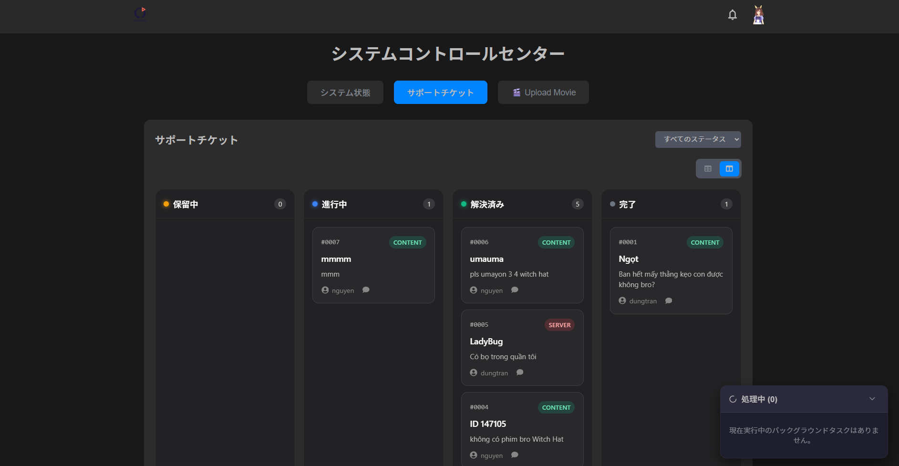

# Zentaku - バックエンド API サービス

[](./README.md) [](#)

これは **Zentaku** プラットフォームのバックエンドサービスです。フロントエンドおよびモバイルアプリケーションをサポートするためのRESTful API、リアルタイムWebSocket通信、およびデータベース管理を提供します。

---

## 🌐 プロジェクトエコシステム

Zentaku は3つの主要なリポジトリに分かれた完全なシステムです：

1. **[Zentaku_BE (バックエンド)](https://github.com/itsdoanguen/Zentaku)** - _現在位置！_
2. **[pbl5_webFE (Webフロントエンド)](https://github.com/UmaMusumeEnjoyer/Zentaku)** - ユーザー向けのWebインターフェース。
3. **[shared-logic (共有ライブラリ)](https://github.com/UmaMusumeEnjoyer/pbl5_fe_shared-logic)** - クライアント間で共有される共通の状態とロジック。

---

## 🛠 技術スタック

- **ランタイム:** Node.js
- **フレームワーク:** Express.js
- **言語:** TypeScript
- **データベース:** MySQL (TypeORM経由) & MongoDB (Mongoose経由)
- **リアルタイム:** Socket.IO
- **認証:** JWT (JSON Web Tokens) & bcrypt
- **ドキュメント:** Swagger (swagger-jsdoc & swagger-ui-express)
- **ファイル処理:** Multer

---

## ✨ 主な機能

- **堅牢なRESTful API:** ユーザー、コンテンツ、データ管理のための標準化されたエンドポイント。
- **リアルタイムエンジン:** Socket.IOを利用した即時通知とデータ同期。
- **デュアルデータベースアーキテクチャ:**
  - `MySQL`: リレーショナルデータ（ユーザー、権限、トランザクション）。
  - `MongoDB`: 非構造化または大容量データ。
- **ロールベースのアクセス制御 (RBAC):** 管理者および一般ユーザー向けのきめ細かい権限設定。
- **安全なファイルアップロード:** Multerを介した効率的なメディアアセットの処理。
- **自動生成APIドキュメント:** エンドポイントのテストと探索のためのSwagger UIの統合。

---

## 🚀 インストールとセットアップ

### 前提条件

- Node.js (v18+)
- MySQL サーバー
- MongoDB サーバー

### 手順

1. **リポジトリのクローン:**

   ```bash
   git clone https://github.com/itsdoanguen/Zentaku.git
   cd Zentaku
   ```

2. **依存関係のインストール:**

   ```bash
   npm install
   ```

3. **環境設定:**
   環境ファイルの例をコピーして設定します：

   ```bash
   cp .env.example .env
   ```

   _`.env` を編集し、DBの認証情報、JWTシークレット、ポートなどを入力してください。_

4. **データベースマイグレーションの実行 (TypeORM):**

   ```bash
   npm run migration:run
   ```

5. **開発サーバーの起動:**
   ```bash
   npm run dev
   ```
   サーバーは `http://localhost:3000` (または設定したポート) で実行されます。

---

## 🔑 環境変数

`.env` ファイルには以下の主要な設定が必要です：

| 変数         | 説明                             | 例                                  |
| ------------ | -------------------------------- | ----------------------------------- |
| `PORT`       | サーバーが実行されるポート       | `3000`                              |
| `DB_HOST`    | MySQL ホスト                     | `localhost`                         |
| `DB_USER`    | MySQL ユーザー名                 | `root`                              |
| `DB_PASS`    | MySQL パスワード                 | `password`                          |
| `MONGO_URI`  | MongoDB 接続文字列               | `mongodb://localhost:27017/zentaku` |
| `JWT_SECRET` | トークン署名用のシークレットキー | `your_super_secret_key`             |

_（変数の完全なリストについては `.env.example` を参照してください）。_

---

## 📁 フォルダ構成

```text
src/
├── controllers/    # リクエストハンドラー
├── middlewares/    # Expressミドルウェア (認証、検証)
├── models/         # Mongoose & TypeORM モデル
├── routes/         # APIルート定義
├── services/       # ビジネスロジックレイヤー
├── sockets/        # Socket.IO イベントハンドラー
├── utils/          # ヘルパー関数
└── server.ts       # エントリーポイント
```

---

## 📸 デモとスクリーンショット

> **開発者へのメモ:** 実際のWebページのスクリーンショットをキャプチャして `docs/images/` ディレクトリに配置し、以下のプレースホルダーを置き換えてください。

### 1. ホーム / 発見ページ


### 2. アニメストリーミングプレーヤー



### 3. アニメスケジュールカレンダー



### 4. リアルタイムチャット



### 5. 同時視聴 (Watch Along)



### 6. 管理者ダッシュボード



---

## 📄 ライセンス

このプロジェクトは ISC ライセンスの下でライセンスされています。
