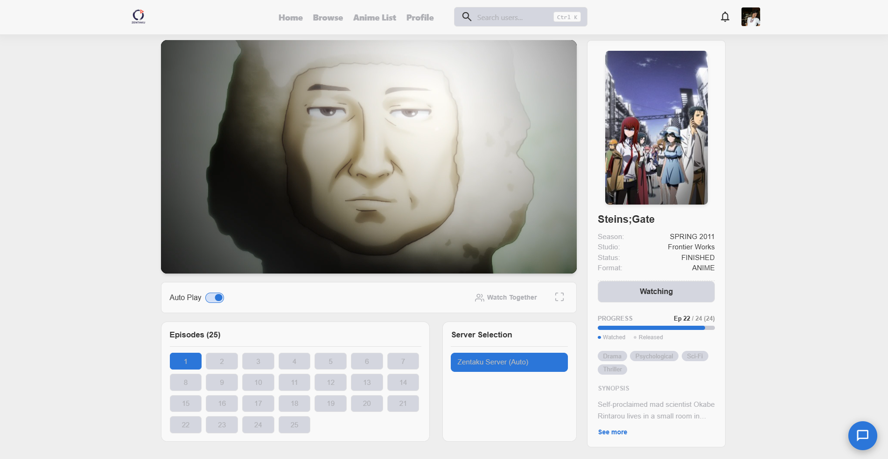
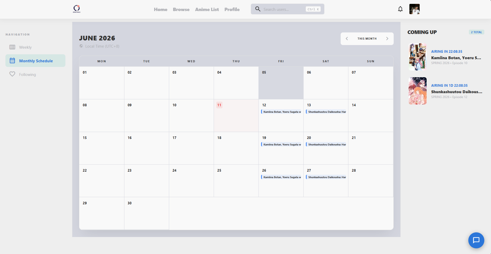
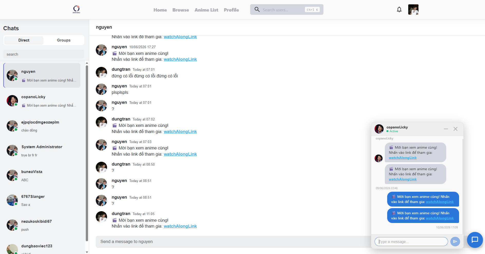
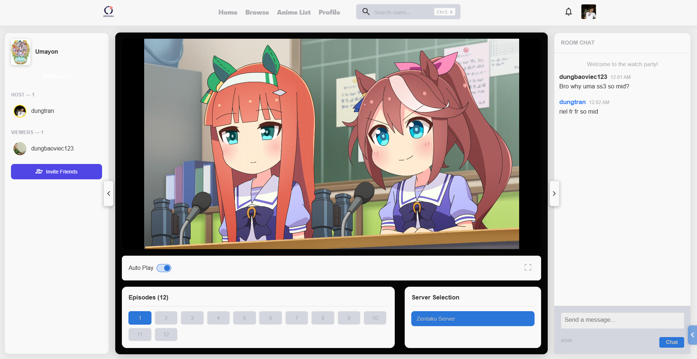
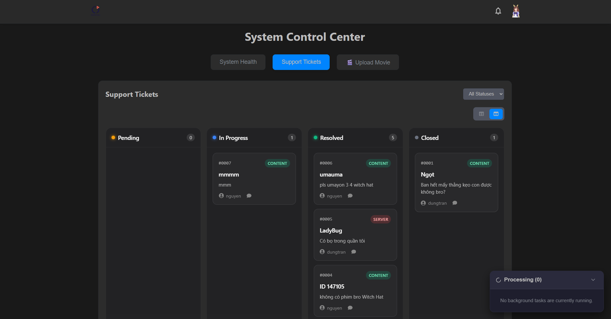

# Zentaku - Backend API Service

[](#) [](./README.ja.md)

This is the backend service for the **Zentaku** platform. It provides RESTful APIs, real-time WebSocket communication, and database management to support the Frontend and Mobile applications.

---

## 🌐 Project Ecosystem

Zentaku is a complete system divided into three main repositories:

1. **[Zentaku_BE (Backend)](https://github.com/itsdoanguen/Zentaku)** - _You are here!_
2. **[pbl5_webFE (Web Frontend)](https://github.com/UmaMusumeEnjoyer/Zentaku)** - The user-facing web interface.
3. **[shared-logic (Shared Library)](https://github.com/UmaMusumeEnjoyer/pbl5_fe_shared-logic)** - Common state and logic shared across clients.
4. **[FilmServer (HLS Transcoder)](#)** - Local HLS Streaming and Video Conversion service.

---

## 🛠 Tech Stack

- **Runtime:** Node.js
- **Framework:** Express.js
- **Language:** TypeScript
- **Database:** MySQL (via TypeORM) & MongoDB (via Mongoose)
- **Real-time:** Socket.IO
- **Authentication:** JWT (JSON Web Tokens) & bcrypt
- **Documentation:** Swagger (swagger-jsdoc & swagger-ui-express)
- **File Handling:** Multer

---

## ✨ Key Features

- **Robust RESTful API:** Standardized endpoints for user, content, and data management.
- **Real-time Engine:** Instant notifications and data syncing powered by Socket.IO.
- **Dual Database Architecture:**
  - `MySQL`: Relational data (users, permissions, transactions).
  - `MongoDB`: Unstructured or high-volume data.
- **Role-based Access Control (RBAC):** Granular permissions for Admin and Standard Users.
- **Secure File Uploads:** Handling media assets efficiently via Multer.
- **Auto-generated API Docs:** Integrated Swagger UI for testing and exploring endpoints.

---

## 🚀 Installation & Setup

### Prerequisites

- Node.js (v18+)
- MySQL Server
- MongoDB Server

### Steps

1. **Clone the repository:**

   ```bash
   git clone https://github.com/itsdoanguen/Zentaku.git
   cd Zentaku
   ```

2. **Install dependencies:**

   ```bash
   npm install
   ```

3. **Environment Setup:**
   Copy the example environment file and configure it:

   ```bash
   cp .env.example .env
   ```

   _Edit `.env` and fill in your DB credentials, JWT secret, and ports._

4. **Run Database Migrations (TypeORM):**

   ```bash
   npm run migration:run
   ```

5. **Start the Development Server:**
   ```bash
   npm run dev
   ```
   The server should now be running at `http://localhost:3000` (or your configured port).

---

## 🔑 Environment Variables

The `.env` file requires the following key configurations:

| Variable     | Description                   | Example                             |
| ------------ | ----------------------------- | ----------------------------------- |
| `PORT`       | The port the server runs on   | `3000`                              |
| `DB_HOST`    | MySQL Host                    | `localhost`                         |
| `DB_USER`    | MySQL Username                | `root`                              |
| `DB_PASS`    | MySQL Password                | `password`                          |
| `MONGO_URI`  | MongoDB Connection String     | `mongodb://localhost:27017/zentaku` |
| `JWT_SECRET` | Secret key for signing tokens | `your_super_secret_key`             |

_(Refer to `.env.example` for the complete list of variables)._

---

## 📁 Folder Structure

```text
src/
├── controllers/    # Request handlers
├── middlewares/    # Express middlewares (Auth, Validation)
├── models/         # Mongoose & TypeORM Models
├── routes/         # API Route definitions
├── services/       # Business logic layer
├── sockets/        # Socket.IO event handlers
├── utils/          # Helper functions
└── server.ts       # Entry point
```

---

## 📸 Demo & Screenshots

> **Note to Developer:** Please capture screenshots of your actual web pages and place them in the `docs/images/` directory, then replace the placeholders below.

### 1. Home / Discover Page


### 2. Anime Streaming Player



### 3. Anime Schedule Calendar



### 4. Real-time Chat



### 5. Watch Along



### 6. Admin Dashboard



---

## 📄 License

This project is licensed under the ISC License.
